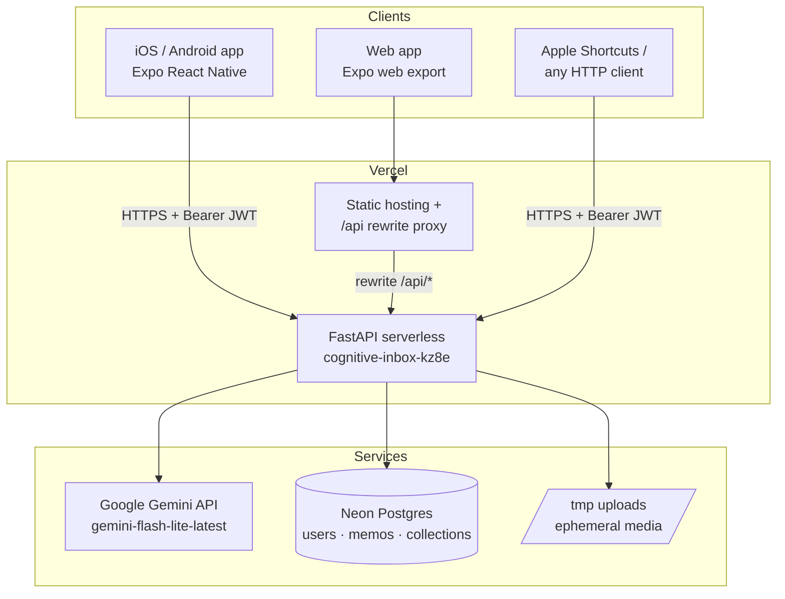

# Cognitive Inbox — Technical Design Document

**Status:** Living document · **Last updated:** 2026-07-06 · **Branch:** `app-store-prep`

---

## 1. What is Cognitive Inbox?

Cognitive Inbox is a "capture anything, AI organizes it" note app. A user types, speaks, or photographs a thought; the backend sends it to Google Gemini, which categorizes it into a collection (Task, Journal, Ideas, …), writes a short summary, extracts action items and tags, and detects emotional tone. Notes are stored per user account and browsable by collection on iOS, Android, and the web.

**Design principles**

1. **Capture friction ≈ zero.** One input box, one button, any modality (text / voice / image). The AI does the filing.
2. **One codebase, three doors.** A single Expo React Native app builds to iOS, Android, and web. The API is also directly usable by automations (e.g., Apple Shortcuts).
3. **Content belongs to the user.** All data is scoped to an authenticated account; AI output follows the language of the note, not the UI.

---

## 2. System architecture



- **Native app** calls the API directly (`EXPO_PUBLIC_API_URL`, falling back to the Metro host during development).
- **Web app** calls same-origin `/api/...`; a Vercel rewrite in `mobile-app/vercel.json` proxies to the backend, avoiding CORS entirely.
- **Anything else** (Shortcuts, scripts) hits the API directly with a bearer token.

### Repository layout

```
cognitive-inbox/
├── backend/                 # FastAPI service
│   ├── app.py               # Vercel serverless entrypoint (package bootstrap)
│   ├── application.yaml     # collections, model name, CORS defaults
│   ├── requirements.txt
│   ├── app/
│   │   ├── main.py          # app factory, CORS, routers, schema migration
│   │   ├── config.py        # pydantic-settings; env + application.yaml
│   │   ├── database.py      # SQLAlchemy engine/session
│   │   ├── models.py        # ORM models + Pydantic schemas
│   │   ├── auth.py          # bcrypt + JWT + get_current_user dependency
│   │   ├── rate_limit.py    # sliding-window in-memory limiter
│   │   ├── routers/         # auth.py, memos.py, collections.py
│   │   └── services/        # gemini.py, memo_service.py, keep_importer.py
│   └── tests/               # pytest suite (mocked Gemini)
└── mobile-app/              # Expo React Native app (iOS/Android/web)
    ├── App.js               # provider tree + auth gate
    ├── app.json             # Expo config, bundle IDs, permission strings
    ├── eas.json             # EAS build profiles (dev/preview/production)
    ├── vercel.json          # web build command + /api rewrite
    └── src/
        ├── config/api.js    # API base URL resolution
        ├── services/        # http.js (auth fetch), api.js (capture/import)
        ├── context/         # Auth, Locale, Log (data), Theme
        ├── i18n/            # translations.js (en/zh), current.js
        ├── pages/           # Auth, Capture, Collection, Setting screens
        └── components/      # VoiceRecorder, MemoDetailModal, LogItem, …
```

---

## 3. Technology stack

| Layer | Choice | Why |
|---|---|---|
| Mobile/web UI | Expo SDK 54, React Native 0.81, React 19 | One codebase for iOS/Android/web; EAS cloud builds without Xcode |
| Styling | StyleSheet + theme context (NativeWind available) | Light/dark themes via `ThemeContext` color tokens |
| API | FastAPI (Python 3.13) + Uvicorn | Async, typed, automatic OpenAPI docs at `/docs` |
| ORM | SQLAlchemy | Works on SQLite (dev) and Postgres (prod) unchanged |
| Database | SQLite locally · Neon Postgres in production | `DATABASE_URL` switches; `postgres://` is normalized to `postgresql://` |
| AI | Google Gemini via `google-genai` SDK | Single multimodal model handles text, image, and audio transcription |
| Auth | PyJWT (HS256) + bcrypt | Stateless bearer tokens; 30-day expiry |
| Hosting | Vercel (two projects) | `cognitive-inbox` (web) + `cognitive-inbox-kz8e` (API) |
| Tests | pytest + FastAPI TestClient | Gemini mocked; runs in ~5s |

---

## 4. Data model

Three tables. All IDs are UUID strings generated in the application.

### `users`

| Column | Type | Notes |
|---|---|---|
| id | string PK | UUID |
| email | string, unique, indexed | lowercased at registration |
| password_hash | string | bcrypt |
| created_at | string | ISO-8601 UTC |

### `memos`

| Column | Type | Notes |
|---|---|---|
| id | string PK | UUID |
| user_id | string, indexed | owner; every query filters on this |
| original_input | string | raw text, or `[mime]` placeholder for media |
| extracted_text | string | text used for analysis |
| summary | string | AI-generated, ≤5 words, in the note's language |
| memo_types | string (JSON array) | e.g. `["Task"]` — values match collection types |
| original_memo_type | string, nullable | pre-completion type, restored when unchecked |
| action_items | string (JSON array) | AI-extracted tasks |
| completed_action_items | string (JSON array of int) | indices into action_items |
| tags | string (JSON array) | free-form AI keywords |
| emotional_tone | string, nullable | stable English values (Neutral, Happy, …) |
| confidence_score | float | 0.9 on success, 0.0 on AI failure |
| created_at | string | ISO-8601 |
| updated_at | datetime | auto-updated |
| media_uri | string, nullable | `/uploads/<uuid>.<ext>` |
| media_type | string, nullable | MIME type |
| html_content | text, nullable | markdown from Google Keep imports |

### `collections`

| Column | Type | Notes |
|---|---|---|
| id | string PK | UUID |
| user_id | string, indexed | owner |
| title / type | string | display name and matching key (kept equal) |
| is_custom | boolean | false for the 7 defaults seeded at registration |
| created_at | string | ISO-8601 |

**Default collections** (from `application.yaml`, seeded per user at registration): Memo, Task, Wishlist, Journal, Ideas, Other, Completed.

**Schema migrations:** there is no Alembic yet. `main.py` runs `Base.metadata.create_all` plus a small startup migration that `ALTER TABLE … ADD COLUMN`s anything introduced after first release (currently `user_id`). Adding a column = add it to the model **and** to `run_schema_migrations()`.

---

## 5. API reference

Base URLs:

- Production: `https://cognitive-inbox-kz8e.vercel.app`
- Web same-origin proxy: `https://cognitive-inbox.vercel.app/api`
- Local dev: `http://localhost:8000`

Every router is mounted twice — bare (`/memos/...`) and under `/api` (`/api/memos/...`) — so both direct calls and the Vercel proxy path work. Interactive OpenAPI docs: `GET /docs`.

### 5.1 Authentication

| Endpoint | Body | Returns |
|---|---|---|
| `POST /auth/register` | `{"email", "password"}` (password 8–72 chars) | `{access_token, token_type, user:{id, email}}` |
| `POST /auth/login` | same | same |
| `GET /auth/me` | — | `{id, email}` |

All other endpoints require the header `Authorization: Bearer <access_token>`. Tokens are HS256 JWTs (`sub` = user id) valid for 30 days (`ACCESS_TOKEN_EXPIRE_MINUTES`). Missing/expired/invalid tokens → `401`.

```bash
curl -X POST $API/auth/register \
  -H 'Content-Type: application/json' \
  -d '{"email":"me@example.com","password":"atleast8chars"}'
```

### 5.2 Memos

| Endpoint | Purpose |
|---|---|
| `POST /memos/capture` | Capture text/audio/image; runs Gemini; returns the created memo |
| `GET /memos/` | All memos for the current user, newest first |
| `PUT /memos/{id}` | Update editable fields (see below) |
| `PATCH /memos/{id}/toggle-action/{index}` | Toggle an action item; auto-moves memo to/from `Completed` |
| `DELETE /memos/{id}` | Delete a memo |
| `POST /memos/import/keep` | Import a Google Keep Takeout ZIP |

**Capture** is `multipart/form-data`:

| Field | Type | Notes |
|---|---|---|
| `text` | string, optional | at least one of text/file required |
| `file` | file, optional | audio/* or image/* only; ≤ 20 MB |
| `available_tags` | JSON array string | the user's custom collection titles, e.g. `["Recipes"]` |
| `preferred_language` | string | `en` (default) or `zh`; AI fallback language for ambiguous input |

```bash
curl -X POST $API/memos/capture \
  -H "Authorization: Bearer $TOKEN" \
  -F "text=remember to buy oat milk" -F "available_tags=[]"
```

Memo response shape (also what `GET /memos/` returns as a list):

```json
{
  "id": "uuid",
  "original_input": "remember to buy oat milk",
  "extracted_text": "remember to buy oat milk",
  "memo_types": ["Task"],
  "summary": "Buy oat milk",
  "action_items": ["Buy oat milk"],
  "completed_action_items": [],
  "tags": ["shopping", "errands"],
  "emotional_tone": "Neutral",
  "confidence_score": 0.9,
  "created_at": "2026-07-06T02:00:00+00:00",
  "updated_at": "2026-07-06T02:00:00+00:00",
  "media_uri": null,
  "media_type": null,
  "original_memo_type": null,
  "archived": false
}
```

**Update** (`PUT /memos/{id}`) accepts a JSON object with any of: `summary`, `original_input`, `action_items`, `tags`, `memo_types`, `emotional_tone`, `completed_action_items`. Unknown keys are ignored (no mass assignment).

**Errors:** `400` no input / bad ZIP · `401` auth · `404` not found *or not yours* (cross-user access is indistinguishable from nonexistent) · `413` too large · `415` unsupported file type · `429` rate limited.

### 5.3 Collections

| Endpoint | Purpose |
|---|---|
| `GET /collections` | List the user's collections |
| `POST /collections?title=Name` | Create a custom collection (title passed as query param) |
| `PUT /collections/{id}?title=NewName` | Rename (custom collections only) |
| `DELETE /collections/{id}` | Delete a custom collection **and all memos typed with it** |

Default collections cannot be renamed or deleted.

### 5.4 Media

Uploaded files are saved as `/uploads/<uuid>.<ext>` and served by the API as static files (unauthenticated, unguessable UUID names). See §9 for the production caveat.

---

## 6. The AI pipeline

`backend/app/services/gemini.py` — single entry point `analyze_content()`.

1. **Prompt assembly.** The allowed category list = default collections + the user's custom collections (sent by the client as `available_tags`). The prompt asks for: one primary type from that list verbatim, free-form tags, action items, a ≤5-word summary, emotional tone, and today's date for temporal references ("next week").
2. **Language rule.** Summary/tags/action items are written **in the same language as the input**; if the language is ambiguous (e.g., a photo with no text), the `preferred_language` field (the app's UI language) is the fallback. `emotional_tone` stays in English so it remains filterable; category names stay verbatim.
3. **Multimodality.** Audio and images are passed as inline bytes (`Part.from_bytes`); Gemini transcribes audio itself — there is no separate speech-to-text service.
4. **Structured output.** `response_mime_type: application/json` with a `TypedDict` schema pins the response shape.
5. **Type validation.** Returned types are matched case-insensitively against the built-in enum, then against the combined collection list; anything unrecognized falls back to `Other`.
6. **Graceful degradation.** Missing API key, quota exhaustion, or any SDK error returns a valid memo with `memo_types=["Other"]`, the raw text as summary, and `confidence_score=0.0` — capture never hard-fails because of the AI.

**Model:** `gemini-flash-lite-latest` (set in `application.yaml` / `GEMINI_MODEL_NAME`). Chosen for cost & latency; capture is interactive.

---

## 7. Frontend design

### Provider tree & auth gate (App.js)

```
GestureHandlerRootView
└── ThemeProvider            (light/dark tokens)
    └── LocaleProvider       (en/zh, t()/tc() helpers, persisted)
        └── AuthProvider     (token + user, session restore)
            └── Root
                ├── <AuthScreen/>        when signed out
                └── <LogProvider>        when signed in (remounts per session)
                    └── <CaptureScreen/> (owns tab switching: Home/Collection/Settings)
```

### Key modules

- **`services/http.js`** — the only place tokens live. `authFetch()` injects `Authorization`; a 401 anywhere triggers the registered sign-out handler. Token persisted in `expo-secure-store` (Keychain/Keystore) on native, `localStorage` on web.
- **`services/api.js`** — capture and Keep import. Text capture uses `authFetch`; file uploads use `expo-file-system`'s `uploadAsync` (more reliable multipart on Android) with the same auth headers. Sends `preferred_language` from the locale module.
- **`context/LogContext.js`** — client-side store of memos + collections; fetches on mount, optimistic updates on delete/edit.
- **`context/LocaleContext.js`** — `t(key, ...args)` for UI strings (dictionaries in `src/i18n/translations.js`), `tc(name)` for display-translating the fixed default collection names (values in the DB stay English so matching never breaks). Language choice persisted like the token.
- **`components/VoiceRecorder.js` / `MemoDetailModal.js`** — recording and playback on `expo-audio` (expo-av is removed).

### API base URL resolution (`config/api.js`)

1. `EXPO_PUBLIC_API_URL` env (all platforms — set in `eas.json` production/preview profiles and for local web testing);
2. web → same-origin `/api` (Vercel proxy);
3. native dev → Metro host on port 8000;
4. fallback `http://localhost:8000`.

---

## 8. Auth design

- **Registration** lowercases the email, bcrypt-hashes the password (8–72 chars enforced by schema), seeds the 7 default collections, and returns a JWT immediately.
- **JWT:** HS256, payload `{sub: user_id, exp}`. Secret comes from `SECRET_KEY`; if unset the server generates an **ephemeral** secret and logs a warning — tokens then die on restart, so production must set it.
- **`get_current_user`** dependency resolves the token to a `UserModel` row on every request; deleted users are rejected even with valid tokens.
- **Isolation:** every service method takes `user_id` and filters queries with it. Cross-user reads/writes return `404`.
- **CORS:** configurable origin list; `allow_credentials=False` because auth is header-based, never cookie-based (also makes `*` origins legal for development).

---

## 9. Hardening & limits

| Guard | Value | Where |
|---|---|---|
| Upload size | 20 MB (`MAX_UPLOAD_MB`) | `memo_service.validate_upload` |
| Upload types | `audio/*`, `image/*` only | same |
| Keep import size | 50 MB (`MAX_IMPORT_MB`) | memos router |
| Capture rate | 20/min per user | `rate_limit.capture_limiter` |
| Import rate | 3 per 5 min per user | `rate_limit.import_limiter` |

The rate limiter is an in-memory sliding window — **per serverless instance** on Vercel, so it's a soft guard against loops/abuse, not a strict quota. Move to a shared store (Upstash Redis) if strictness ever matters.

**Known limitations (accepted for now):**

1. **Media persistence.** Uploads land in `/tmp` on Vercel — memos and transcriptions persist in Postgres, but the underlying audio/image files are lost on instance recycle. Fix: Vercel Blob or S3 (planned next).
2. **No refresh tokens** — a single 30-day JWT; logout is client-side deletion.
3. **No Alembic** — schema evolution is the startup migration function.
4. **`react-native-markdown-display`** carries an unfixed ReDoS advisory (renders only the user's own imported notes; low practical risk).
5. Remaining `npm audit` items require the Expo SDK 54→57 major upgrade.

---

## 10. Internationalization

- UI languages: English and Simplified Chinese; toggle in Settings → Preferences → Language, persisted per device.
- Dictionaries: `src/i18n/translations.js`; parameterized entries are functions (`importedCount(n)`).
- **Content language ≠ UI language.** AI output follows the note's own language (§6). Default collection names are translated at display time only.
- Adding a language = add a dictionary + a `COLLECTION_NAMES_XX` map in `LocaleContext` + extend the toggle; the backend's `LANGUAGE_NAMES` map in `gemini.py` gains one entry.

---

## 11. Environments & deployment

### Vercel projects

| Project | Content | URL |
|---|---|---|
| `cognitive-inbox` | web app (`expo export -p web`, `dist/`) + `/api` rewrite | https://cognitive-inbox.vercel.app |
| `cognitive-inbox-kz8e` | FastAPI backend (root dir `backend/`, `app.py` entrypoint) | https://cognitive-inbox-kz8e.vercel.app |

Deploy: `vercel --prod` from the repo root (backend, linked to `-kz8e`) and from `mobile-app/` (web). The Neon Postgres resource (`cognitive-inbox`) is attached to the backend project and injects `DATABASE_URL` automatically.

### Backend environment variables

| Var | Required in prod | Purpose |
|---|---|---|
| `DATABASE_URL` | yes (injected by Neon) | `postgres://` accepted; normalized to `postgresql://`; sqlite paths on Vercel are moved to `/tmp` |
| `SECRET_KEY` | **yes** | JWT signing; generate with `openssl rand -hex 32` |
| `GOOGLE_API_KEY` | yes | Gemini |
| `GEMINI_MODEL_NAME` | no | default `gemini-flash-lite-latest` |
| `BACKEND_CORS_ORIGINS` | recommended | JSON array or CSV; default `*` |
| `ACCESS_TOKEN_EXPIRE_MINUTES` | no | default 43200 (30 days) |
| `MAX_UPLOAD_MB` / `MAX_IMPORT_MB` | no | defaults 20 / 50 |
| `UPLOAD_DIR` | no | default `/tmp/uploads` |

### Local development

```bash
# backend
cd backend && source venv/bin/activate && uvicorn app.main:app --port 8000 --reload
# app (iOS simulator / Expo Go)
cd mobile-app && npx expo start
# web against local backend
EXPO_PUBLIC_API_URL=http://localhost:8000 npx expo export -p web && npx serve dist -s
```

### iOS distribution

`app.json`: name **Cognitive Inbox**, bundle ID `com.paulinechi.cognitiveinbox`, mic/camera/photo permission strings, `ITSAppUsesNonExemptEncryption=false`. `eas.json` production profile pins `EXPO_PUBLIC_API_URL` to the production API. Pipeline: `eas build --platform ios --profile production` → `eas submit` → TestFlight. Prerequisites: Apple Developer Program (Individual) + Expo account.

---

## 12. Testing

`backend/tests/` — 17 pytest cases against a throwaway SQLite DB with Gemini monkeypatched (the mock records call args, letting tests assert e.g. that `preferred_language` reaches the AI layer). Coverage: register/login/me, duplicate & weak-password rejection, 401s on every protected route, capture→list→update→delete, **cross-user isolation** (foreign memos/collections 404), upload MIME/size rejection, collection CRUD + default seeding.

```bash
cd backend && ./venv/bin/python -m pytest tests/ -q
```

Frontend has no automated tests yet; the web export build (`expo export -p web`) is the compile gate, plus manual/browser QA.

---

## 13. Integration example: Apple Shortcuts

Any HTTP-capable automation can capture memos:

1. `POST {base}/auth/login` once to get a token (30-day validity).
2. Per note: `POST {base}/memos/capture` as **Form** data — field `text` = note body — with header `Authorization: Bearer <token>`.
3. Batch imports should pause ~4s between requests to stay under the 20/min rate limit.

This is how Apple Notes bulk import works today: Shortcuts' *Find Notes* → *Repeat* → *Get Contents of URL* (Form body) → *Wait 4s*.

---

## 14. Roadmap

| Priority | Item | Notes |
|---|---|---|
| P0 | Durable media storage | Vercel Blob/S3; fixes §9.1 |
| P0 | TestFlight build | blocked only on Apple Developer enrollment |
| P1 | iOS Share Extension | capture from any app's share sheet |
| P1 | Privacy policy + App Store privacy labels | mic/camera/photos; content processed by Google Gemini; no analytics/tracking SDKs |
| P2 | Alembic migrations | replace startup ALTERs |
| P2 | Expo SDK 57 upgrade | clears remaining npm audit items |
| P2 | Shared rate limiting (Upstash) | if abuse ever observed |
| P3 | Re-analyze button | re-run old memos through the language-aware pipeline |
